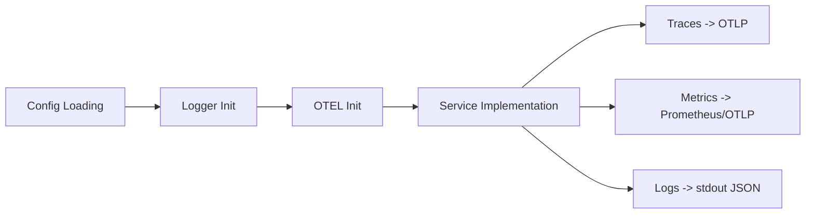

# go-observability

Lightweight observability helpers for Go microservices: configuration patterns, structured logging
(Zap), and OpenTelemetry integration (traces & metrics).

## Quick links

- Overview and architecture
- Getting started
- Configuration and runtime flags
- Logging and tracing
- Middleware (Gin, gRPC)

## Architecture

